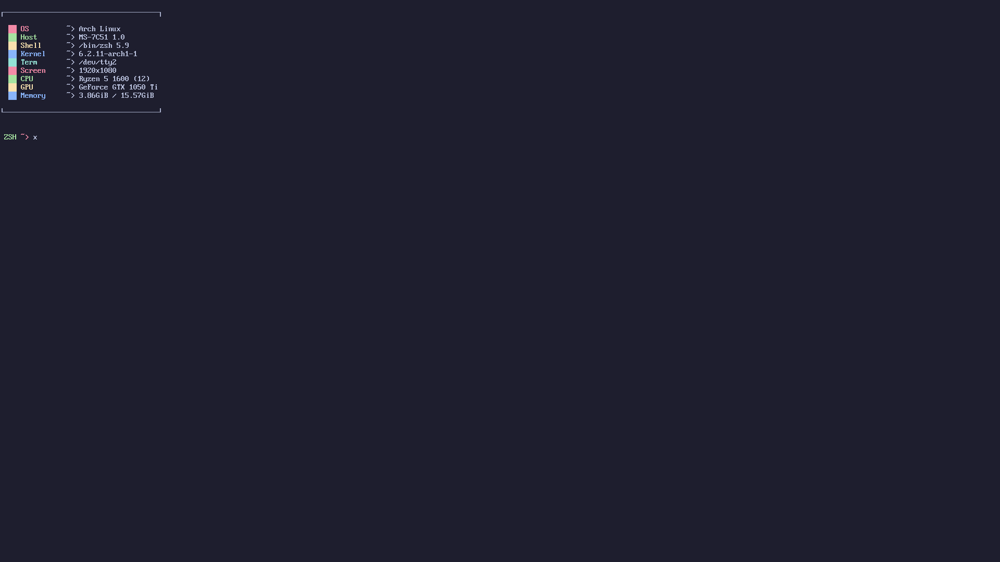

To install:  
 ```git clone https://github.com/s8seer/dotfiles.git```

#### Prerequisites:
https://addons.mozilla.org/en-US/firefox/addon/nighttime-stars-animated-theme/

#### Preferred Window Manager is 'Awesome'!

 
#### Screenshot From TTY2

Colors are made possible with '.zshrc'
